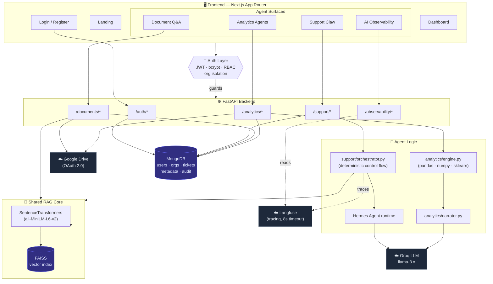

## 🗺 Architecture

FlowClaw is a multi-tenant FastAPI backend behind a Next.js frontend. An auth layer (JWT + RBAC + org isolation) guards every route; three agent surfaces share one grounded RAG core, and every agent run is traced to Langfuse and surfaced in the in-app Observability dashboard.



### Support Escalation Claw — workflow

The escalation decision is a **deterministic rule in Python, not the LLM** — so a critical issue is always escalated regardless of how confident the drafted answer sounds.

```mermaid
flowchart LR
    Q["Support query<br/>+ JWT (org-scoped)"] --> C["Classify<br/>issue type + severity<br/>(Hermes, keyword fallback)"]
    C --> R["Retrieve SOP context<br/>(FAISS, scoped to<br/>sop/faq/policy/runbook)"]
    R --> D["Draft grounded response<br/>(Hermes — says 'I don't know'<br/>rather than invent)"]
    D --> E{"Escalation decision<br/><b>deterministic rule</b>,<br/>not the LLM"}

    E -->|"grounded &<br/>low/medium"| RES["✅ RESOLVED"]
    E -->|"ungrounded draft"| TIC["🎫 TICKETED<br/>(human review)"]
    E -->|"high / critical"| ESC["🚨 ESCALATED"]

    RES --> A[("Audit trail + ticket<br/>persisted to MongoDB<br/>by run_id, org-scoped")]
    TIC --> A
    ESC --> A

    A -.every step traced.-> LF["☁️ Langfuse<br/>→ Observability dashboard"]

    classDef decision fill:#7c2d12,stroke:#f97316,color:#ffedd5;
    class E decision;
