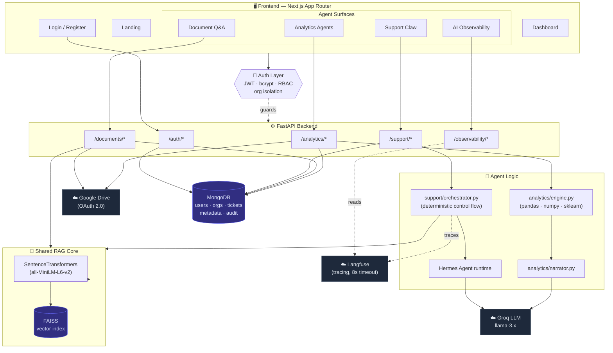
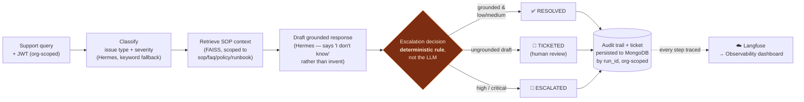

# FlowClaw — Multi-Tenant Autonomous AI Agent Platform

FlowClaw is a multi-tenant platform for running **autonomous AI agents over your own data**, with full observability and audit trails on every run. It ships three agent surfaces on a shared, grounded RAG core:

- **Document Q&A** — upload files (or import from Google Drive), then chat with them, answers backed by exact citations.
- **Analytics Agents ("Claws")** — point five specialised agents at a spreadsheet; every number is computed deterministically, the LLM only narrates.
- **Support Escalation Claw** — a bounded agent that resolves or safely escalates a support query end-to-end, not just answers it.

Every tenant (organisation) is isolated: users register into an org, get a JWT, and see only their own org's data. Every agent run is traced and auditable.

> Built as a trial assignment for the **AI Platform Engineer** role.

---

## 🗺 Architecture

FlowClaw is a multi-tenant FastAPI backend behind a Next.js frontend. An auth layer (JWT + RBAC + org isolation) guards every route; three agent surfaces share one grounded RAG core, and every agent run is traced to Langfuse and surfaced in the in-app Observability dashboard.



### Support Escalation Claw — workflow

The escalation decision is a **deterministic rule in Python, not the LLM** — so a critical issue is always escalated regardless of how confident the drafted answer sounds.



---

## 🔐 Authentication & Multi-Tenancy

FlowClaw is multi-tenant from the ground up. Registration creates an organisation and makes the first user its **Admin**; every subsequent request is scoped to that org.

- **JWT auth (HS256):** register/login issue a bearer token (`JWT_SECRET`, TTL via `JWT_TTL_HOURS`). `bcrypt`-hashed passwords.
- **Org isolation:** data (tickets, audit runs, documents, datasets, vector chunks and Drive credentials) is stored and queried scoped to the caller's `org_id`. A cross-org read returns `404` — one org cannot see or mutate another's data. `search_faiss` *requires* an `org_id` and raises rather than performing an unscoped search, so a call site that forgets to pass one fails loudly instead of silently reading across tenants.
- **Role-based access control (RBAC):** five ranked roles gate what each user can do.

| Role | Capability |
|------|-----------|
| **Admin** | Full control: org settings, members, everything |
| **Manager** | Manage agents & documents, view all analytics |
| **Analyst** | Run analytics claws, read documents |
| **Support** | Run the Support Escalation Claw, manage tickets |
| **Viewer** | Read-only across the org |

On the Support vertical this is enforced live: mutating a ticket requires Admin/Manager/Support, while Viewers get read-only access.

### Auth API
| Method | Endpoint | Purpose |
|--------|----------|---------|
| `POST` | `/auth/register` | Create a user + org (first user becomes Admin), returns a JWT |
| `POST` | `/auth/login` | Authenticate, returns a JWT |
| `GET`  | `/auth/me` | Current user + org + role (requires bearer token) |

---

## 📊 AI Observability Dashboard

An in-app observability surface reads traces back from [Langfuse](https://langfuse.com) and renders them without leaving FlowClaw.

- **Header metrics:** total traces, avg / p95 latency, token totals, estimated cost, error rate — over a selectable window (1h / 24h / 7d / 30d).
- **Run volume** time series, **outcomes** breakdown (resolved / escalated / …), and **per-model usage**.
- **Recent traces** list with a drill-in drawer showing the full workflow timeline, reasoning, and retrieved context per run.

The Langfuse client is configured with a timeout (`LANGFUSE_TIMEOUT`, default 8s) and every observability endpoint degrades gracefully — if Langfuse is slow or unreachable, the dashboard shows empty/zero state instead of hanging.

### Observability API
| Method | Endpoint | Purpose |
|--------|----------|---------|
| `GET` | `/observability/status` | Whether tracing is enabled |
| `GET` | `/observability/overview?hours=` | Aggregate metrics for the dashboard header |
| `GET` | `/observability/traces?hours=&limit=` | Recent traces with per-run headline metrics |
| `GET` | `/observability/trace/{id}` | Full detail for one trace (spans, reasoning, context) |

---

## ✨ Document Q&A (RAG Core)

The grounded retrieval core the agents share.

- **Ingestion:** upload `.pdf` / `.docx` / `.txt` (via `PyMuPDF` / `python-docx`) or import directly from **Google Drive** (OAuth 2.0). Metadata (`file_id`, `name`, `mimeType`, `modifiedTime`) is tracked in MongoDB.
- **Chunking:** cleaned and split into ~250-word segments with 50-word overlap to fit the embedding model's 256-token window without loss.
- **Embeddings:** `SentenceTransformers` (`all-MiniLM-L6-v2`) running locally, batched (size 4) with aggressive GC to avoid OOM on limited hardware.
- **Vector store:** **FAISS** (`IndexFlatIP`, cosine similarity) for fast local retrieval; **MongoDB** persists metadata and chat history.
- **Retrieval:** top-15 chunks for wide context; "summarize" requests are auto-detected and rewritten to scan the whole document.
- **Answering:** **Groq** (`llama-3.3-70b-versatile` / `llama-3.1-8b-instant`), strictly grounded — it refuses to answer if the content isn't in the synced documents, and every answer returns its exact source citations.

---

## 🧠 Analytics Agents ("Claws")

Point five specialised agents at a CSV/Excel file (uploaded or imported from Drive).

> **Design principle:** every number is computed **deterministically** in `pandas` / `numpy` / `scikit-learn`. The LLM (Groq) only turns the pre-computed statistics into a readable narrative — it is forbidden from inventing figures. If `GROQ_API_KEY` is missing or rate-limited, each agent falls back to a computed-facts summary, so it never breaks.

| Claw | What it does |
|------|--------------|
| **Data Analyst** | Cleans the data, surfaces KPIs + trends + correlations, writes a structured insight summary. |
| **KPI Monitoring** | Compares each metric period-over-period, flags significant moves, explains causes, recommends actions. |
| **Anomaly Detection** | Flags unusual values using **z-score + IQR**, with timestamps and explanations. |
| **Customer Segmentation** | Clusters entities with **KMeans** (auto-`k` via silhouette score) and describes each segment. |
| **Business Performance** | Orchestrates all of the above into an executive report: highlights, risks, segment insights, next actions. |

### How it works
1. **Ingest** — CSV/XLSX/TSV upload or Drive import → cleaned (whitespace, dupes, currency→numeric, date parsing) → stored as Parquet with metadata in MongoDB.
2. **Compute** — `analytics/engine.py` computes KPIs, time-series trends (with partial-bucket trimming), anomalies, period changes, segments.
3. **Narrate** — `analytics/narrator.py` sends the computed JSON facts to Groq for a grounded, markdown insight.
4. **Visualise** — the `/analytics` dashboard renders KPI cards, sparkline trends, anomaly tables, segment cards.

### Analytics API
| Method | Endpoint | Purpose |
|--------|----------|---------|
| `POST` | `/analytics/upload` | Upload a CSV/Excel dataset (multipart) |
| `GET`  | `/analytics/datasets` | List the org's datasets |
| `GET`  | `/analytics/dataset/{id}` | Dataset profile + preview |
| `DELETE` | `/analytics/dataset/{id}` | Delete a dataset |
| `GET`  | `/analytics/drive/list` | List CSV/Excel/Sheets in Drive |
| `POST` | `/analytics/drive/import?file_id=...` | Import a Drive spreadsheet |
| `GET`  | `/analytics/claws` | List available agents |
| `POST` | `/analytics/run` | Run a Claw `{ dataset_id, claw }` |

A demo file lives at **`sample_data/sales_sample.csv`** (540 rows of synthetic sales data with an embedded trend + injected anomalies). Open the dashboard → **"Analytics Agents"**, or go to `/analytics`.

---

## 🛟 Support Escalation Claw

A bounded autonomous agent that owns the **end-to-end resolution** of a support query, rather than just answering it.

> **Design principle:** the agent's reasoning steps (classification, drafting) run on **Hermes Agent** (`pip install hermes-agent`) pointed at Groq, with all autonomous toolsets (browser, terminal, file, code execution) explicitly disabled — single-turn text reasoning only. The control flow (retrieval scoping, escalation decision, ticket creation, audit logging) is plain deterministic Python in `support/orchestrator.py`, **not** LLM-decided — so a critical-severity issue is always escalated regardless of how confident the drafted answer sounds. See `claw-docs/` for the full design writeup.

### Workflow
```
RECEIVED → CLASSIFIED → SOP_RETRIEVED → DRAFTED → (RESOLVED | TICKETED | ESCALATED)
```
1. **Classify** — issue type (`billing` / `technical` / `access` / `bug` / `feature_request` / `general`) + severity (`low` / `medium` / `high` / `critical`), via Hermes Agent with a deterministic keyword-fallback if the LLM call fails.
2. **Retrieve SOP context** — scoped to the caller's org, then to synced documents named with `sop`/`faq`/`policy`/`runbook`, reusing the existing FAISS index. Retrieval never widens its scope on error.
3. **Draft a grounded response** — via Hermes Agent, instructed to say "I don't know" rather than invent a policy.
4. **Decide escalation** — a fixed rule, not the LLM: `critical`/`high` always escalates; an ungrounded draft is ticketed for human review even at lower severity.
5. **Persist** — every run gets a ticket (if needed) and a full audit trail, scoped to the org and inspectable by `run_id`.

Each run emits a Langfuse trace (`run_support_workflow`) with nested spans for classify, memory retrieve, SOP retrieve, draft, escalation decision, and memory save — visible in the Observability dashboard.

### Support API
All endpoints require a bearer token and are scoped to the caller's org.

| Method | Endpoint | Purpose |
|--------|----------|---------|
| `POST` | `/support/resolve` | Run the full workflow on a query `{ query }` |
| `GET`  | `/support/tickets` | List tickets, optionally filter (`?status=open\|escalated\|resolved`) |
| `GET`  | `/support/ticket/{ticket_id}` | Get a single ticket |
| `POST` | `/support/ticket/{ticket_id}/resolve` | Mark a ticket resolved (Admin/Manager/Support only) |
| `GET`  | `/support/audit/{run_id}` | Full audit trail of one workflow run |
| `GET`  | `/support/audit` | List recent workflow runs |

Try it (after logging in and using your token):
```bash
curl -X POST http://localhost:8000/support/resolve \
  -H "Content-Type: application/json" \
  -H "Authorization: Bearer <your-token>" \
  -d '{"query": "My production server is down, urgent!"}'
```

---

## 🛠 Tech Stack

**Backend**
- Python 3.9+ · FastAPI
- MongoDB (metadata, tickets, users, orgs) · FAISS (vector store)
- PyTorch & SentenceTransformers (embeddings)
- `pandas` / NumPy / scikit-learn (Analytics Agents)
- Groq SDK · Hermes Agent (Support Claw runtime)
- Google API Client (OAuth & Drive)
- PyJWT + bcrypt (auth) · Langfuse (observability)

**Frontend**
- Next.js (App Router) · React · TailwindCSS
- Framer Motion · Lucide React · React Markdown

---

## ⚙️ Local Development Setup

### Prerequisites
1. Python 3.9+
2. Node.js 18+
3. A MongoDB cluster URI
4. A Groq API key
5. *(Optional)* Google Cloud OAuth 2.0 Client IDs (for Drive integration)
6. *(Optional)* Langfuse keys (for the observability dashboard)

### 1. Backend

```bash
cd backend

python -m venv venv
source venv/bin/activate      # Windows: venv\Scripts\activate

pip install -r requirements.txt

touch .env                    # then fill in the values below
```

Add to `backend/.env`:
```env
# Core
ENVIRONMENT=development
PORT=8000
FRONTEND_URL=http://localhost:3000
API_URL=http://127.0.0.1:8000
MONGO_URI=your_mongodb_uri
GROQ_API_KEY=your_groq_api_key
GROQ_MODEL=llama-3.1-8b-instant

# Auth (required for register/login)
JWT_SECRET=your_long_random_secret        # e.g. python3 -c "import secrets; print(secrets.token_urlsafe(48))"
JWT_TTL_HOURS=24

# Google Drive (optional)
GOOGLE_CREDENTIALS_PATH=credentials.json

# Support Claw memory (optional — degrades gracefully if unset)
MEM0_API_KEY=your_mem0_api_key

# Observability / tracing (optional — a no-op if the two keys are unset)
LANGFUSE_PUBLIC_KEY=your_langfuse_public_key
LANGFUSE_SECRET_KEY=your_langfuse_secret_key
LANGFUSE_HOST=https://cloud.langfuse.com
LANGFUSE_TIMEOUT=8
```

> **Generate `JWT_SECRET`:** `python3 -c "import secrets; print(secrets.token_urlsafe(48))"`
>
> **Observability is optional.** If the two Langfuse keys are absent, tracing is a no-op and the workflow runs unchanged; the Observability dashboard simply reports "not enabled". When enabled, the client uses `LANGFUSE_TIMEOUT` so a slow/unreachable Langfuse can't block requests.
>
> **Google Drive is optional.** Place your OAuth `credentials.json` in the backend root if you want Drive import; otherwise use direct file upload.
>
> **Drive credentials are per organisation.** Completing the OAuth flow stores a token at `backend/drive_tokens/token_<org_id>.json`, and `/auth/login` requires a FlowClaw JWT so the resulting credentials are attached to the caller's org. Synced files land in `backend/synced_docs/<org_id>/`. One org connecting or disconnecting Drive never affects another.

Start the backend (run from the `backend` directory):
```bash
uvicorn main:app --host 0.0.0.0 --port 8000 --reload
```

### 2. Frontend

```bash
cd frontend
npm install
touch .env.local
```

Add to `frontend/.env.local`:
```env
NEXT_PUBLIC_API_URL=http://localhost:8000
```

Start the frontend:
```bash
npm run dev
```

Then open **http://localhost:3000**, register an account (you become the Admin of a new org), and explore the dashboard: Document Q&A, Analytics Agents, Support Escalation Claw, and the AI Observability dashboard.
